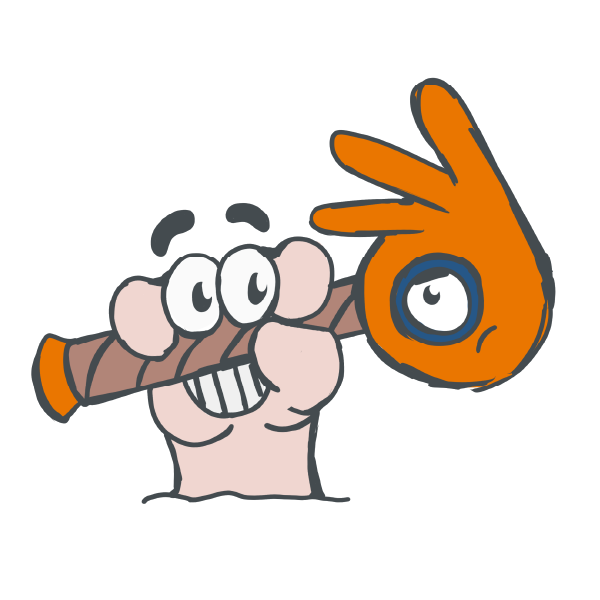
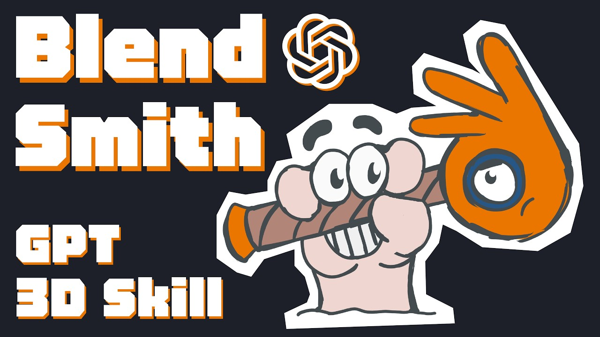
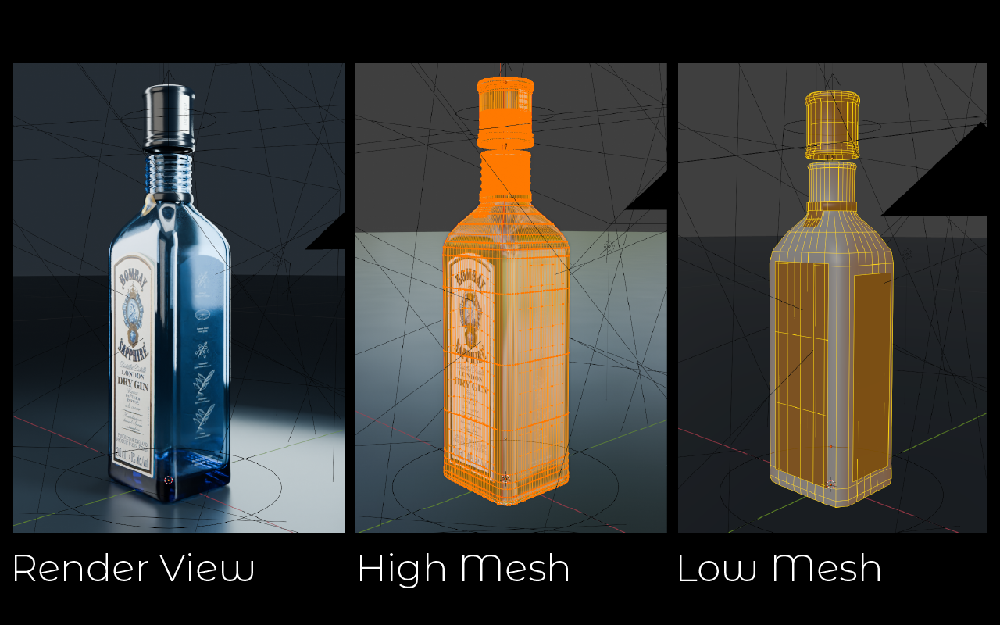
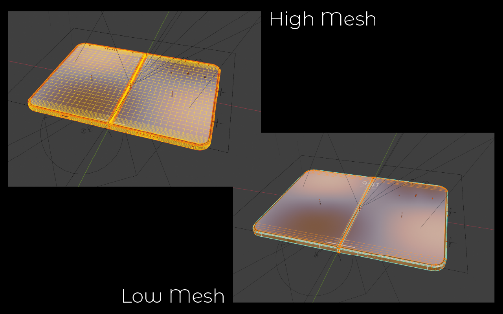
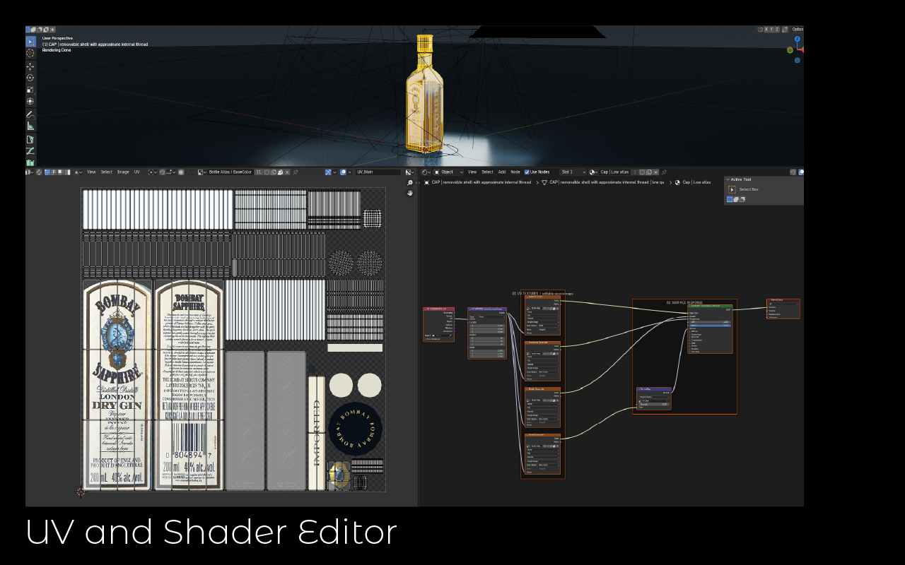
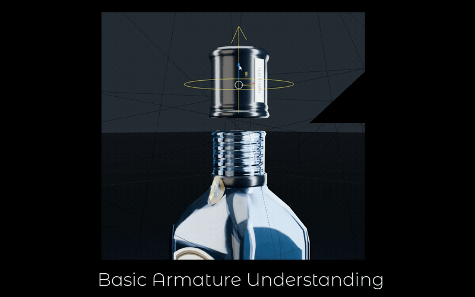
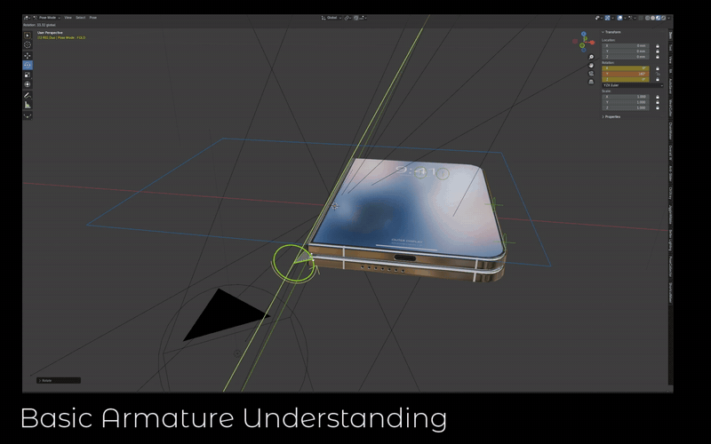

<p align="center">
  
</p>

# blendsmith

**Reference-led Blender assets, built for the person who edits them next.**

[繁體中文](README.zh-TW.md) · [Skill instructions](skill/blendsmith/SKILL.md) · [Contribute](CONTRIBUTING.md) · [Changes](CHANGELOG.md)

**Version 2026.09.011 · Public preview · GPL-3.0-only · Blender 4.4 workflow baseline**

blendsmith gives an AI assistant a practical workflow for clarifying references, producing editable Blender assets, and checking the handoff. It grew from repeated artist feedback on product models, rigs, baking and architecture.

It is an instruction-based skill, not a Blender add-on, a one-click mesh generator, or an industry certification. It requires an assistant with access to your reference files and a working way to operate Blender. Installing the documents does not grant filesystem access or install Blender.

## What it looks like

A video walkthrough of the skill:

[](https://youtu.be/SRVl_M4WBmY)

These are frames from the project's own asset trials, not a benchmark suite. Private scene files are not included.

A reference-led high mesh and a budgeted low derivative that keeps the silhouette (R03):





Non-overlapping UVs on an agreed atlas, beside a Shader Editor graph arranged left to right with named frames (R01–R02):



Animator-facing Armature controls, operated and keyframed in Pose Mode rather than through Object Mode empties (R10):





## What it covers

| Area | Expected behavior |
| --- | --- |
| Reference and scope | Inspect references, identify uncertainty and hidden structures, recap requirements before production |
| Shape and topology | Check silhouettes first; agree budgets/counting; use editable triangle/quad topology with controlled openings |
| UV and textures | Agree atlas count, square resolution and UDIM needs; verify UV quality and four PBR channels |
| Shaders and baking | Readable Coordinate → Mapping → image chains; finalize normals before bake; verify proxy consistency |
| Rigging | Confirm controls, hierarchy and limits; use animator-facing Armature pose bones; test real interaction |
| Delivery | Execute and save the actual `.blend`, reopen it, provide an accessible file link; preserve sources, maps, selection and Extras |
| Feedback | English logs, evidence-linked rule updates, clear limits and pending acceptance |

English instructions are authoritative; a Traditional Chinese reading copy is included. The assistant should communicate in the user's language. These are project conventions; explicit user requirements govern agreed departures. There is no universal polygon budget or smoothing angle.

## Get started

1. Use the [English request template](skill/blendsmith/assets/user-request.template_EN.md) or [Traditional Chinese template](skill/blendsmith/assets/user-request.template.zh-TW.md). Unknown dimensions can be identified as unknown.
2. Make the skill available to your assistant. For local Codex use, copy the complete `skill/blendsmith` folder into your project as `.agents/skills/blendsmith`, or into your personal `~/.agents/skills/blendsmith` directory. Keep the included license. Avoid installing both copies at once.
3. Invoke `$blendsmith` and provide the asset workspace, references, purpose and desired output. If the skill is not visible, restart the host or explicitly ask it to read the skill's file path.
4. Review the reference analysis and consolidated brief, then confirm production. Existing confirmations should be reused.

Example request:

> Use $blendsmith to analyze my product references. I need a Blender-renderable model with a folding lid and pressable buttons. Propose geometry and texture budgets, list unknown and hidden structures, and recap the rig before modeling. Keep the source files and write an English worklog in my project.

The skill alone can also be read by another file-capable assistant; automatic discovery and tools depend on that host. See the [official Codex skill documentation](https://learn.chatgpt.com/docs/build-skills). This repository is a skill source package, not a published plugin.

## Evidence and current limits

The inherited trials improved readable shader graphs, native controls, panel topology, normals and source-to-atlas delivery. Historical outcomes are summarized in the [feedback register](skill/blendsmith/references/feedback-register.md). Private scene files and original evidence are not included, so these are reported case histories, not an independently reproducible benchmark suite.

Irregular silhouettes, close-up reference fidelity, intricate hinges and viewpoint-dependent effects still require artist review. A successful render or document validation does not establish a production-ready asset. Some historical trials have unfinished stages. See [known limits](docs/known-limitations.md).

## Improve blendsmith

Fork → focused branch → change + evidence → Pull Request → maintainer review.

**New to this?** Use the **Fork** button at the top right of this page to get your own copy, commit the change there, then open a pull request from the **Contribute** button on your fork. Prefer not to use Git? [Open an issue](https://github.com/brianchenanimator/blendsmith/issues/new/choose), or send a ZIP as described under [offline submissions](CONTRIBUTING.md#offline-submissions). Questions, and "here is what I built with it" posts, belong in [Discussions](https://github.com/brianchenanimator/blendsmith/discussions).

Read [CONTRIBUTING.md](CONTRIBUTING.md). Preserve R01–R11 rule IDs. Include a uniquely named [change record](changes/TEMPLATE.md) with the base version, before/after behavior, scope and actual test results. Offline ZIP submissions use the same record. The maintainer assigns release versions; pending proposals are not established production rules.

Run the dependency-free repository checks with Python 3.10 or newer:

```bash
python scripts/validate.py
```

These checks cover packaging and document consistency, not Blender geometry or artistic quality.

## Repository map

- `skill/blendsmith/`: installable instructions, references, templates and metadata.
- `changes/`: public contribution records, one per change.
- `docs/`: publishing, maintenance and limitations.
- `.github/`: PR/issue templates and document-check workflow.
- `scripts/validate.py`: local and CI document checks.

Production `worklog/`, backups and model outputs stay local by default. New public evidence must be selected deliberately.

## Version naming

Current versions use `YYYY.MM.NNN`: year, two-digit month and three-digit release sequence within that month. Metadata uses `2026.09.011`; GitHub tags use `v2026.09.011`. The initial CalVer label is maintainer-selected and does not claim nine earlier public releases. See [publishing guidance](docs/publishing.md).

## License

[GNU GPL v3 only](LICENSE) (`GPL-3.0-only`). See [NOTICE.md](NOTICE.md) for provenance and distribution scope.
